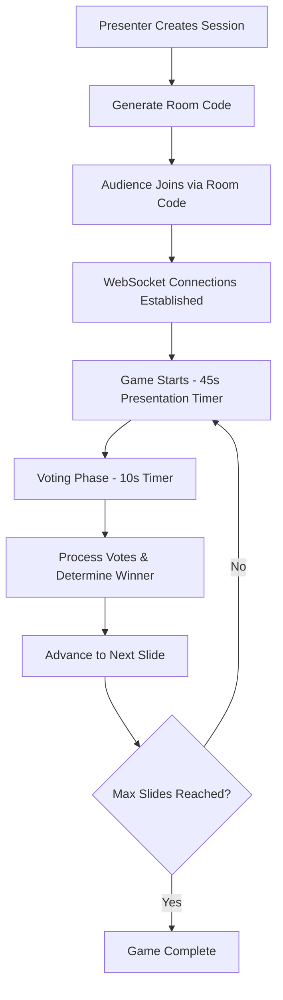

# Battle Decks - Architecture Documentation

## Overview

Battle Decks is a real-time presentation game built on Cloudflare Workers where presenters improvise with random slides while the audience votes to control slide progression. The architecture leverages Cloudflare's edge computing platform for global low-latency performance.

## High-Level Architecture

### Core Technologies
- **Backend**: Cloudflare Workers (TypeScript)
- **State Management**: Durable Objects with SQLite storage
- **Real-time Communication**: WebSockets with hibernation support
- **Storage**: Cloudflare R2 (slide images) + KV (metadata)
- **AI**: Cloudflare Workers AI for slide embedding generation
- **Frontend**: Vanilla JavaScript with modern CSS

### Architecture Principles

1. **Two-Phase Design**: Pre-compute relationships (setup) → Real-time gameplay (runtime)
2. **Edge-First**: Deployed globally on Cloudflare's edge network
3. **Hibernation-Ready**: Durable Objects that survive restarts and handle alarms
4. **Real-time First**: Sub-100ms vote registration with instant feedback
5. **Stateless Workers**: All state persisted in Durable Objects

## System Components

### 1. Entry Point (src/index.ts)
- **Request Router**: Routes static assets and API calls
- **CORS Handler**: Enables cross-origin requests
- **Session Management**: Creates and routes to Durable Object instances
- **Asset Serving**: Static files from ASSETS binding, slide images from R2

### 2. Game Session (src/game-session.ts)
- **Durable Object Class**: Manages individual game instances
- **SQLite Storage**: Persistent state across hibernation
- **WebSocket Management**: Real-time client connections
- **Game Logic**: Vote processing, slide transitions, timer management
- **Alarm Handler**: Manages game phase transitions

### 3. Frontend Interfaces
- **Vote Interface** (`/vote`): Audience voting with room code entry
- **Admin Interface** (`/admin`): Presenter controls and game management
- **Display Interface** (`/display`): Main screen for slide presentation

## Data Flow

## Key Features

### Real-time Communication
- **WebSocket Hibernation**: Connections survive Durable Object restarts
- **Broadcast System**: Instant updates to all connected clients
- **Connection Recovery**: Automatic reconnection with exponential backoff

### State Management
- **SQLite Persistence**: Game state survives hibernation and restarts
- **Room Code Recovery**: Persistent room codes for reliable session access
- **Vote Deduplication**: Prevents double voting with user tracking

### Performance Optimization
- **Global Edge Deployment**: Sub-100ms latency worldwide
- **Efficient Broadcasting**: Optimized message distribution
- **Asset Caching**: 24-hour cache for slide images
- **Connection Pooling**: Efficient WebSocket management

## Security Considerations

- **CORS Protection**: Configurable cross-origin policies
- **Input Validation**: Type-safe request/response handling
- **Rate Limiting**: Implicit through Durable Object model
- **Session Isolation**: Each game session in separate DO instance

## Deployment Architecture

### Cloudflare Resources
- **Worker**: Main application logic
- **Durable Objects**: Game session instances
- **R2 Bucket**: Slide image storage (`battle-decks-slides`)
- **KV Namespace**: Metadata storage (`DECKS`)
- **Workers AI**: Embedding generation for slide relationships

### Environment Configuration
- **Production**: `battle-decks`
- **Staging**: `battle-decks-staging`
- **Local Development**: `wrangler dev` with local bindings

## Scaling Characteristics

- **Horizontal Scaling**: Each game session runs in isolated DO
- **Global Distribution**: Automatic edge deployment
- **Auto-scaling**: Durable Objects scale to zero when inactive
- **Connection Limits**: 100+ concurrent users per game session
- **Performance Targets**:
  - Vote registration: <100ms
  - Slide transitions: Instant
  - WebSocket message delivery: <50ms

## Error Handling & Resilience

- **Graceful Degradation**: Continues operation during partial failures
- **Automatic Recovery**: Durable Objects restart and recover state
- **Connection Resilience**: WebSocket reconnection with backoff
- **Alarm Reliability**: Critical timers use Durable Object alarms
- **State Consistency**: SQLite transactions ensure data integrity

## Development Workflow

1. **Local Development**: `wrangler dev` with hot reload
2. **Type Safety**: Full TypeScript coverage with strict checks
3. **Environment Parity**: Staging environment mirrors production
4. **Asset Management**: Static assets served via ASSETS binding
5. **Logging**: Comprehensive logging with `wrangler tail`