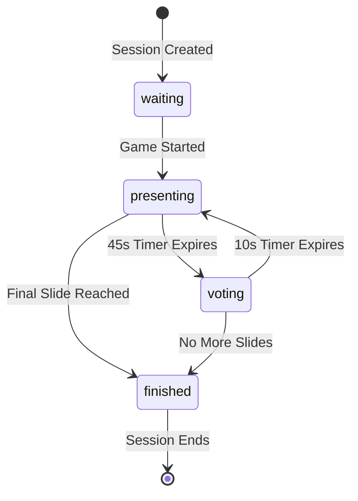

# Battle Decks - Data Structures & Game Logic Documentation

## Overview

Battle Decks uses a sophisticated data structure system to manage game state, slide relationships, and real-time interactions. The architecture separates persistent data (SQLite) from runtime state (memory) for optimal performance.

## Core Data Structures

### 1. Game State (In-Memory)

The primary game state structure maintains the current session status:

```typescript
interface GameState {
  sessionId: string;           // Unique session identifier (room code)
  currentSlide: string;        // Current slide ID (e.g., "slide_1")
  usedSlides: Set<string>;     // Slides already shown (prevents repetition)
  phase: GamePhase;            // Current game phase
  votes: {                     // Current vote tally
    logical: number;
    chaotic: number;
  };
  voters: Set<string>;         // Users who voted this round (prevents double voting)
  votingOpen: boolean;         // Whether voting is currently allowed
  timerEnd: number;            // Unix timestamp when current timer expires
  slideCount: number;          // Current slide number (1-based)
  maxSlides: number;           // Maximum slides for this game
}
```

**Design Rationale**:
- **Sets for Uniqueness**: Prevents slide repetition and double voting
- **Unix Timestamps**: Precise timer management across clients
- **Atomic Operations**: State changes are transaction-safe
- **Memory Efficiency**: Only active data kept in memory

### 2. Game Phases

Game progression follows a strict state machine:

```typescript
type GamePhase = 'waiting' | 'presenting' | 'voting' | 'finished';
```

**Phase Transitions**:


**Phase Characteristics**:
- **Waiting**: Room open, waiting for presenter to start
- **Presenting**: 45-second timer, presenter speaking
- **Voting**: 10-second timer, audience voting active
- **Finished**: Game complete, results displayed

### 3. Slide Adjacency System

The core innovation of Battle Decks is the pre-computed slide relationship system:

```typescript
interface SlideData {
  id: string;                  // Unique slide identifier
  title: string;               // Slide title/description
  imageUrl: string;            // R2 storage URL
  logical: string[];           // Most semantically similar slides
  chaotic: string[];           // Least semantically similar slides
}
```

**Database Schema**:
```sql
CREATE TABLE adjacency (
  slide_id TEXT PRIMARY KEY,
  logical_slides TEXT NOT NULL,  -- JSON array of similar slide IDs
  chaotic_slides TEXT NOT NULL   -- JSON array of dissimilar slide IDs
);
```

**Example Adjacency Record**:
```json
{
  "slide_1": {
    "logical": ["slide_2", "slide_3", "slide_4"],
    "chaotic": ["slide_8", "slide_9", "slide_10"]
  }
}
```

**Adjacency Generation Process**:
1. **Embedding Creation**: Cloudflare Workers AI generates embeddings
2. **Similarity Calculation**: Cosine similarity between all slide pairs
3. **Ranking**: Sort by similarity score
4. **Selection**: Top 3 similar (logical) and top 3 dissimilar (chaotic)

## Persistent Data Structures

### 1. SQLite Storage Schema

Three tables manage persistent state across Durable Object hibernation:

#### Game Session Table
```sql
CREATE TABLE game_session (
  session_id TEXT PRIMARY KEY,     -- Room code (e.g., "ABCDEF")
  current_slide TEXT NOT NULL,     -- Current slide ID
  used_slides TEXT NOT NULL,       -- JSON array of used slide IDs
  phase TEXT NOT NULL,             -- Game phase as string
  slide_count INTEGER NOT NULL,    -- Current slide number
  max_slides INTEGER NOT NULL,     -- Total slides for game
  timer_end INTEGER NOT NULL,      -- Timer expiration timestamp
  created_at INTEGER NOT NULL,     -- Session creation time
  updated_at INTEGER NOT NULL      -- Last update time
);
```

#### Adjacency Table
```sql
CREATE TABLE adjacency (
  slide_id TEXT PRIMARY KEY,       -- Slide identifier
  logical_slides TEXT NOT NULL,    -- JSON array of logical next slides
  chaotic_slides TEXT NOT NULL     -- JSON array of chaotic next slides
);
```

#### Metadata Table
```sql
CREATE TABLE do_metadata (
  key TEXT PRIMARY KEY,            -- Metadata key (e.g., "room_code")
  value TEXT NOT NULL,             -- Metadata value
  created_at INTEGER NOT NULL      -- Creation timestamp
);
```

### 2. Type Safety & Validation

**SQL Row Types**:
```typescript
interface SqlRow {
  [key: string]: ArrayBuffer | string | number | null;
}

interface GameRecord extends SqlRow {
  session_id: string;
  current_slide: string;
  used_slides: string;    // JSON string
  phase: string;          // Cast to GamePhase
  slide_count: number;
  max_slides: number;
  timer_end: number;
  created_at: number;
  updated_at: number;
}
```

**Type Guards**:
```typescript
function isGameRecord(row: SqlRow): row is GameRecord {
  return typeof row === 'object' && row !== null &&
    typeof row.session_id === 'string' &&
    typeof row.current_slide === 'string' &&
    // ... additional validations
}
```

## Game Logic Implementation

### 1. Vote Processing Algorithm

```typescript
async vote(userId: string, choice: VoteChoice): Promise<Response> {
  // Validation
  if (!this.gameState.votingOpen) return error("Voting closed");
  if (this.gameState.voters.has(userId)) return error("Already voted");

  // Record vote
  this.gameState.votes[choice]++;
  this.gameState.voters.add(userId);

  // Broadcast update
  this.broadcastVoteUpdate();

  return success({ currentVotes: this.gameState.votes });
}
```

**Vote Processing Features**:
- **Duplicate Prevention**: User tracking prevents double voting
- **Real-time Updates**: Immediate broadcast to all clients
- **Atomic Operations**: State changes are immediately persisted
- **Validation**: Multiple layers of input validation

### 2. Slide Transition Logic

```typescript
private async processVotesAndAdvance(): Promise<void> {
  // Determine winner
  const winner = this.gameState.votes.logical > this.gameState.votes.chaotic
    ? 'logical' : 'chaotic';

  // Get next slide options
  const nextSlide = this.getNextSlide(winner);

  if (!nextSlide || this.gameState.slideCount >= this.gameState.maxSlides) {
    // Game finished
    this.gameState.phase = 'finished';
    return;
  }

  // Advance to next slide
  this.gameState.currentSlide = nextSlide;
  this.gameState.usedSlides.add(nextSlide);
  this.gameState.slideCount++;
  this.gameState.phase = 'presenting';

  await this.saveGameState();
  this.broadcastSlideChange(nextSlide);
}
```

### 3. Timer Management

**Alarm-Based Timers**:
```typescript
// Start presentation timer (45 seconds)
private startPresentationTimer(): void {
  this.ctx.storage.setAlarm(Date.now() + 45000);
}

// Start voting timer (10 seconds)
private async startVotingTimer(): Promise<void> {
  this.gameState.votingOpen = true;
  this.gameState.voters.clear();
  this.gameState.votes = { logical: 0, chaotic: 0 };
  this.ctx.storage.setAlarm(Date.now() + 10000);
}
```

**Alarm Handler**:
```typescript
async alarm(): Promise<void> {
  if (this.gameState.phase === 'presenting') {
    // Check for final slide
    if (this.gameState.slideCount >= this.gameState.maxSlides) {
      this.gameState.phase = 'finished';
    } else {
      this.gameState.phase = 'voting';
      await this.startVotingTimer();
    }
  } else if (this.gameState.phase === 'voting') {
    await this.processVotesAndAdvance();
  }
}
```

## WebSocket Message Protocol

### Message Types

```typescript
type WebSocketMessageType =
  | 'gameState'     // Complete state update
  | 'voteUpdate'    // Live vote count change
  | 'slideChange'   // Slide transition
  | 'timerUpdate'   // Timer synchronization
  | 'error'         // Error notification
  | 'pong';         // Heartbeat response
```

### Message Structure

```typescript
interface WebSocketMessage {
  type: WebSocketMessageType;
  data: any;                    // Type-specific payload
  timestamp: number;            // Message creation time
}
```

### Example Messages

**Game State Update**:
```json
{
  "type": "gameState",
  "data": {
    "sessionId": "ABCDEF",
    "currentSlide": "slide_3",
    "phase": "voting",
    "votes": { "logical": 15, "chaotic": 8 },
    "timeRemaining": 7500,
    "slideCount": 3,
    "maxSlides": 10,
    "votingOpen": true
  },
  "timestamp": 1640995200000
}
```

**Vote Update**:
```json
{
  "type": "voteUpdate",
  "data": {
    "votes": { "logical": 16, "chaotic": 8 }
  },
  "timestamp": 1640995201000
}
```

## Performance Optimizations

### 1. Memory Management

**Efficient Data Structures**:
- **Sets over Arrays**: O(1) lookups for used slides and voters
- **JSON Serialization**: Minimal storage overhead
- **State Partitioning**: Only load necessary data into memory

**Memory Usage Patterns**:
- **Peak Usage**: During active voting (all connections + state)
- **Hibernation**: Only SQLite data persisted
- **Recovery**: Fast state reconstruction from database

### 2. Database Optimizations

**Query Patterns**:
```typescript
// Efficient slide lookup
const result = this.sql.exec(
  'SELECT * FROM adjacency WHERE slide_id = ?',
  this.gameState.currentSlide
).one();

// Batch state updates
this.sql.exec(`
  INSERT OR REPLACE INTO game_session
  (session_id, current_slide, used_slides, phase, ...)
  VALUES (?, ?, ?, ?, ...)
`, ...values);
```

**SQLite Performance**:
- **Indexes**: Primary keys provide O(log n) lookups
- **Prepared Statements**: Query plan caching
- **PRAGMA optimize**: Automatic query optimization
- **Transaction Batching**: Minimize disk I/O

### 3. Real-time Performance

**WebSocket Optimizations**:
- **Message Batching**: Multiple updates in single message
- **Selective Broadcasting**: Only send relevant updates
- **Connection Pooling**: Efficient connection management
- **Heartbeat Protocol**: Detect and cleanup stale connections

## Error Handling & Edge Cases

### 1. State Consistency

**Concurrent Vote Handling**:
- Durable Objects provide single-threaded execution
- No race conditions between vote submissions
- Atomic state updates ensure consistency

**Recovery Scenarios**:
- **Hibernation Recovery**: Room code metadata enables recovery
- **Connection Loss**: Clients reconnect and sync state
- **Timer Desync**: Server-authoritative timer management

### 2. Edge Case Handling

**Insufficient Slides**:
- Game ends early if no valid next slides available
- Graceful degradation to finished state
- Clear messaging to users about early termination

**Network Partitions**:
- Clients continue with cached state
- Reconnection triggers full state synchronization
- No data loss due to server-authoritative model

**Invalid Transitions**:
- State machine prevents invalid phase transitions
- Vote validation prevents out-of-phase submissions
- Comprehensive error responses for debugging